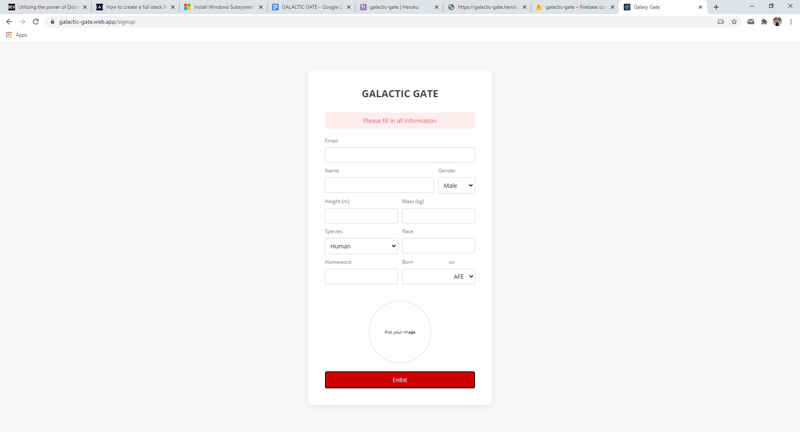
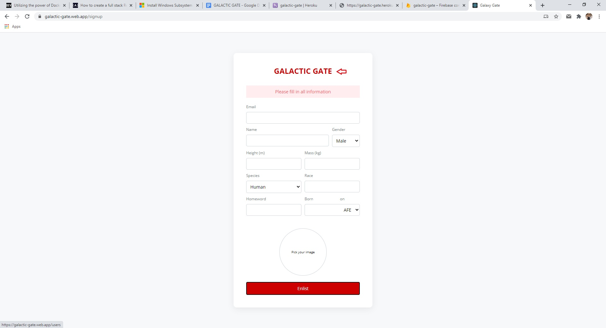
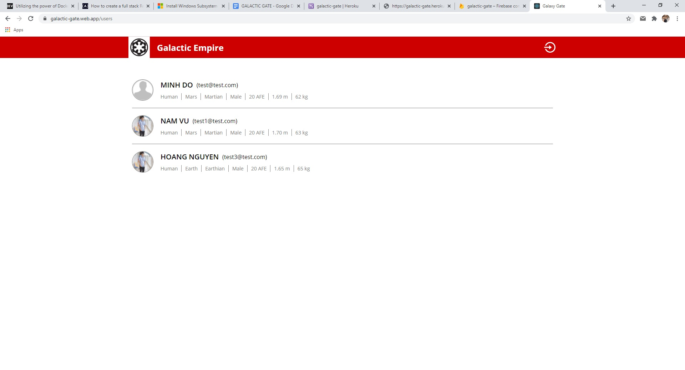
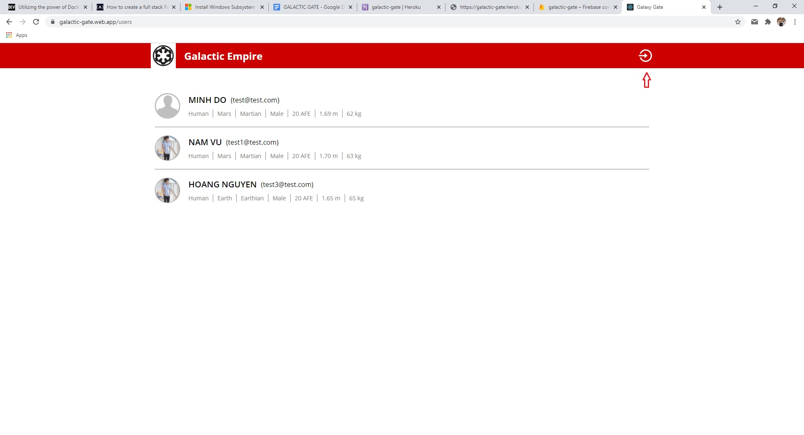

# Galactic Gate: stormtrooper recruitment portal

A full-stack project, collect information of potential new recruitment for galactic empire. Built with Typescript, NodeJS, MongoDB, ReactJS, styled-components, axios.

- Backend: https://galactic-gate.herokuapp.com/api/users 
- Frontend: https://galactic-gate.web.app/
- API endpoint doc: https://documenter.getpostman.com/view/13161986/TW6tNAmY#fed8fd0a-b283-4202-9563-d468031dc386

## Features

- SignUp to enlist to emprial army.
- Support avatar upload
- Display all users have enlisted
   

## How to use

- Fill in all information in order to proceed.

    

- Click on the "Galactic Gate" title to navigate to users page

    

- Users page display all enlisted users

    

- Click on signup icon to navigate back to signup

    